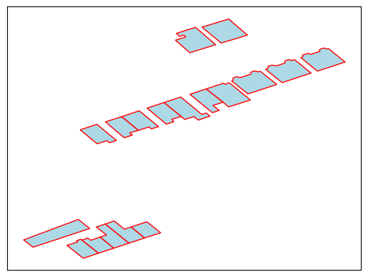

==================
Usage and examples
==================

Overview: reading in data and running a simulation
--------------------------------------------------

Simstock reads in geographical data, performs some geometric simplification steps, creates EnergyPlus idf objects, and then finally runs an EnergyPlus simulation. Simstock also provides a convenient interface to modify EnergyPlus settings such as materials, constructions, and schedules. 

Simstock is structured around two objects: the ``SimstockDataframe`` and the ``IDFmanager``. The ``SimstockDataframe`` is an extension of a `Pandas Dataframe <https://pandas.pydata.org/docs/reference/api/pandas.DataFrame.html>`_. It allows data to be read in from a variety of formats. It also performs geometruc simplification on the data. The ``SimstockDataframe`` also contains the EnergyPlus settings, allowing easy manipulation of materials etc. Once these settings have been set, and any geometrical simplification perfomed, the ``IDFmanager`` then creates the necessary thermal zones from the ``SimstockDataframe``. The ``IDFmanager`` can also be used to run an EnergyPlus simulation. 

Below is an example of a typical Simstock work flow.

.. code-block:: python 

    # Import the simstock package
    import simstock as sim

    # Let's say we have some test data stored in a file called test.csv. 
    # We can read it in as a SimstockDataframe:
    sdf = sim.read_csv("test.csv")

    # We now perform geometrical pre-processing:
    sdf.preprocessing()

    # Now create an new instance of an IDFmanager object that takes the
    # processed SimstockDataframe as an argument:
    simulation = sim.IDFmanager(sdf)

    # Create the thermal zones necessary for EnergyPlus
    simulation.create_model_idf()

    # Run the energy plus simulation
    simulation.run()

By default this will create all the EnergyPlus output files and save them into a directory call ``outs``.

Data requirements
-----------------

The input data may be in csv, geopackage, or parquet formats. The rows of the data should represent different buildings or premises. Simstock requires the following fields for each building or premises:

.. admonition:: Required fields \ \ 

   - ``polygon`` The geometric data for the building/premises. Allowable formats:
    - Shapely geometries
    - ``wkb`` strings
    - ``wkt`` strings
   - ``osgb`` A unique ID. Allowable formats:
    - String 
    - Integer 
   - ``shading`` - ``bool`` (whether or not the building is purely a shading object)
   - ``height`` - ``integer`` or ``float`` (height of building)
   - ``wwr``- ``integer`` or ``float`` (window to wall ratio)
   - ``nofloors`` - ``integer`` (number of floors)
   - ``construction`` - ``string`` (the type of contrucion)

If your geometry and unique ID columns are named something other than ``polygon`` or ``osgb``, then you must specify their names during the creation of a SimstockDataframe. This is done using the ``polygon_column_name`` and ``uid_columm_name`` parameters. E.g., if you have a data file called ``test_data.csv``, whereing your geometry column is named ``building_geom`` and your osgb unique ID is called ``building_ID``, then:

.. code-block:: python 

    sdf = sim.read_csv(
        "test_data.csv",
        polygon_column_name = "building_geom"
        uid_column_name = "building_ID"
        )

.. hint:: \ \ 

    You can input data that contains only the ``osgb`` and ``polygon`` fields, without the rest of the required fields. If you do this, Simstock will append empty columns with the required names and raise a message telling you to fill them in.

Reading different data formats
------------------------------

SimstockDataframes can be instatiated from an already `Pandas Dataframe <https://pandas.pydata.org/docs/reference/api/pandas.DataFrame.html>`_, a python dictionary, or another SimstockDataframe. However, SimstockDataframes can also be created directly from data files using the ``read`` functions. Below is a summary of reading different formats. 

csv files
~~~~~~~~~

SimstockDataframes can be instatiated from csv files using the ``read_csv`` function. E.g.:

.. code-block:: python 

    sdf = sim.read_csv("test_data.csv")

The input csv must conform to the standard outlined above in the data requirements section.

Parquet files
~~~~~~~~~~~~~

SimstockDataframes can be instatiated from parquet files using the ``read_parquet`` function. E.g.:

.. code-block:: python 

    sdf = sim.read_parquet("test_data.parquet")

The input parquet file must conform to the standard outlined above in the data requirements section.

Geopackage files
~~~~~~~~~~~~~~~~

A layer of a geopackage can be read in and turned into a SimstockDataframe using the ``read_geopackage_layer`` function, while specifying the layer name in the ``layer_name`` parameter. E.g., if you have a geopackage named ``london.gpkg`` containing a layer called ``croydon``, then you can read in this layer via the command 

.. code-block:: python

    sdf = sim.read_geopackage_layer("london.gpkg", layer_name="croydon")

Note that when reading in a geopackage, you do not need to explicitly set the ``polygon`` column or field in the data. Once the geopackage has been read, the resulting SimstockDataframe will contain the extracted geometries in a column calledd polygon. E.g.:

.. code-block:: python

    # Read in geopackage layer
    sdf = sim.read_geopackage_layer("london.gpkg", layer_name="croydon")

    # Print the extracted geomtric data from the geopackage
    print(sdf['polygon'])

    # Equivalently
    print(sdf.polygon)

If you wish to see the names of the layers in your geopackage before creating a SimstockDataframe you can use the function ``get_gpkg_layer_names``. E.g.:

.. code-block:: python

    # Print the names of layers in the geopackage 
    layers = sim.get_gpkg_layer_names("london.gpkg")

You could then, for example, read all the layers in as a list of SimstockDataframes:

.. code-block:: python

    # Create empty list
    sdf_list = []

    # Iteraate over all layers in the geopackage
    for layer in sim.get_gpkg_layer_names("london.gpkg"):
        
        # Read in the layer as a SimstockDataframe and add to list
        sdf = sim.read_geopackage_layer("london.gpkg", layer_name=layer)
        sdf_list.append(sdf)

Plotting data
-------------

Simstock comes with some basic options for visualising the geographic data stored in the SimstockDataframe, utilising ``matplotlib``. 

E.g. the following code 

.. code-block:: python 

    import matplotlib.pyplot as plt

    sim.plot(sdf, facecolor="lightblue", edgecolor="red")
    plt.show()

would produce the figure below.

|
|
|
|
|
|
|
|
|
|
|

.. Specifying weather data
.. -----------------------

.. This can be done by setting the epw. By default, this or that will happen.

.. Specifying schedules, materials, and constructions
.. --------------------------------------------------

.. This can be done programmatically or via csvs.

.. Running the simulation
.. ----------------------

.. This can be run by running ``.run``.

.. Finer grained control
.. ---------------------

.. This can be done like this. 

.. Using built island mode
.. -----------------------

.. That can be switched on or off like this.

.. Common problems
.. ---------------

.. .idd file not found
.. *******************

.. Specifiy this here.

