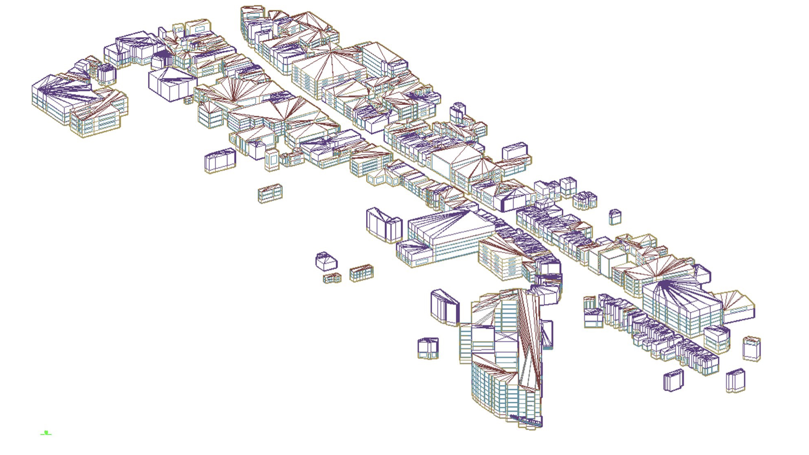

================================
Overview of Simstock methodology
================================

.. note:: \ \ 

    This page is incomplete.

This page should serve as a brief summary of what simstock does. Basically a summary of the paper, complete with some illustrations, perhaps lifted from Ivan's powerpoint like the one below. This page could also be updated later to link to the paper.

