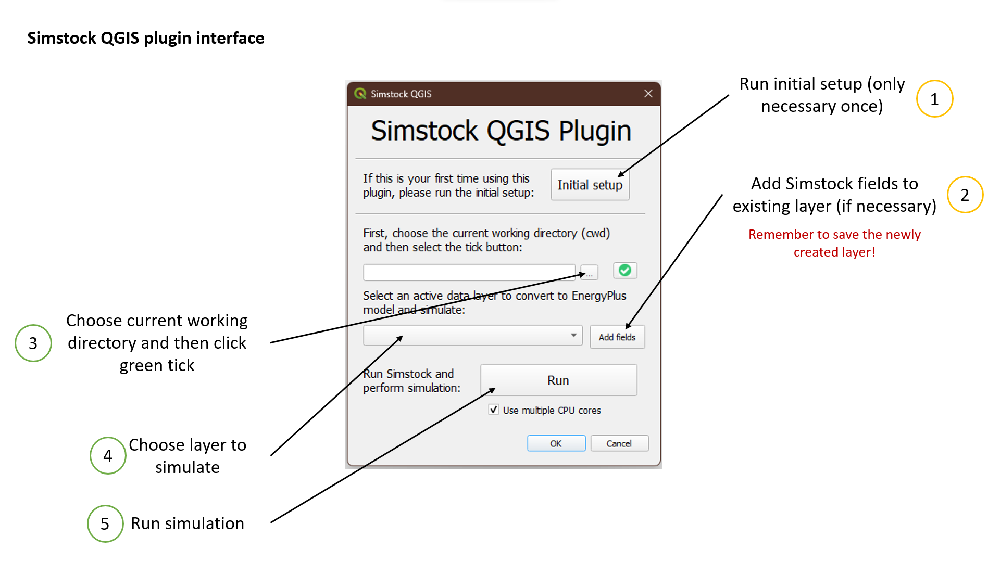
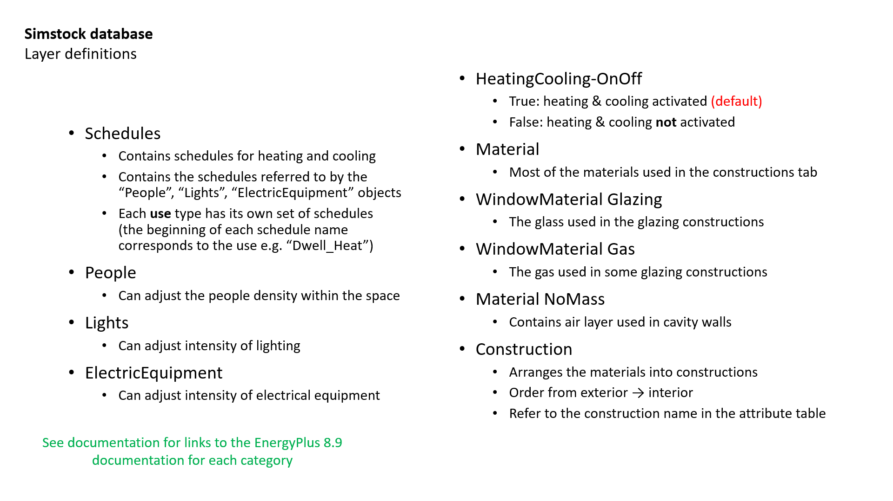
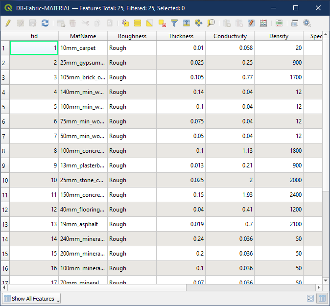
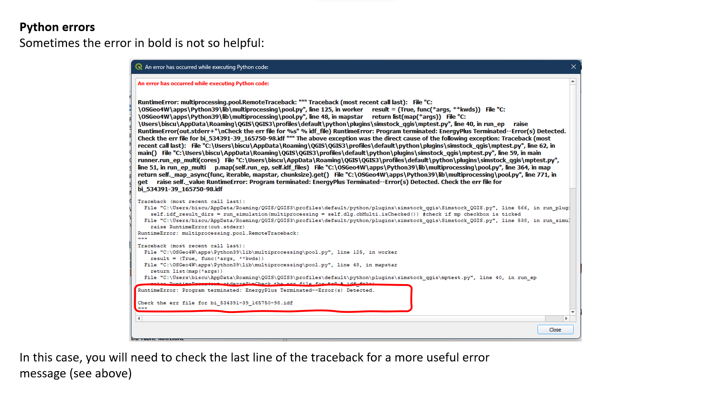

Simstock QGIS Plugin Documentation
**********************************

.. _Installation:

Installation, setup and testing
===============================

Supported QGIS versions
-----------------------

The plugin has been tested on a range of QGIS versions, on both Windows and Mac operating systems. The supported versions of QGIS are any LTR (long-term release) between QGIS LTR 3.10 and the latest QGIS LTR 3.22.

The non-LTR versions are likely to work too, however sometimes the Python versions and associated packages in these versions differ from the LTR versions.

Installation
------------

1. The Simstock QGIS plugin is available from the official `QGIS Python Plugins Repository <https://plugins.qgis.org/plugins/>`_. It can be installed directly in QGIS by navigating to Plugins -> Manage and install plugins.

2. Also search for 'Plugin Reloader' and install it.
    
3. After installing these, you may need to restart QGIS.
    
4. If the Simstock QGIS plugin has successfully been installed, you should be able to see it listed under the 'Plugins' list as well as a new icon on the toolbar.

5. The plugin will now need to be setup - see the next section for information.

Initial setup
-------------
Before running anything, make sure that the QGIS Python Console is open as there will be outputs here that will be useful to read. It should open automatically when the plugin is launched, but if not, you can do this by clicking **Plugins** -> **Python Console** in the top bar of QGIS.

When the plugin is launched, you will see an **Initial Setup** button. This will run checks to verify that all the dependencies are working as expected.

Click the **Initial Setup** button and watch the Python console for any errors. If any of the steps fail, they should be reported here. If all checks passed, a green success message should show up in the QGIS console. The plugin should now be fully functioning - though you may need to restart QGIS for a final time.

----

.. _UsingPlugin:

Using the plugin
================

Important notes
---------------
There are some important things to note when using the plugin:

* **Python Console**: When using the plugin, always have the Python console open. This will output information about what the plugin is doing. It should open by default when the plugin is launched, but if not, you can do this by clicking Plugins -> Python Console in the top bar of QGIS.
* **Python Errors**: If an error occurs, a yellow notification appears in QGIS. The Python error can be viewed by clicking 'Stack Trace'. This should give information about what is causing the error.
* **Plugin Reloader**: Make sure the `Plugin Reloader <https://plugins.qgis.org/plugins/plugin_reloader/>`_ is also installed. The Simstock plugin will need to be reloaded after each use.

.. figure:: Figures/QG-pyconsole.png
   :width: 720px
   :alt: alternate text
   :align: left

|
|
|
|

|
|
|
|
|
|
|
|
|
|
|
|
----

Overall workflow
----------------
The figure below describes the Simstock plugin workflow at a glance. Step 1 only needs to be run once, and step 2 is optional depending on your input data. For detailed descriptions of each component, see the relevant sections of the documentation.

|
|
|
|
|
|
|
|
|
|
|
|
|
|
|
|
|
----

.. _Input data:

Input data
----------
Before the plugin is run, the input data must be prepared in such a way that Simstock can process it.

Geometry
^^^^^^^^
The geometry (i.e. buildings footprints) must exist as a Vector Layer. There are no requirements about where this geometry is sourced from; it can be hand-drawn or acquired from a digital source. The plugin retrieves the geometry directly from the selected layer's feature geometries using the built-in QGIS Python API.

Attribute table fields
^^^^^^^^^^^^^^^^^^^^^^
The input data for each polygon is specified via the QGIS attribute table. Simstock expects certain fields to exist here. These fields can be added to the Vector Layer by selecting the layer in the drop-down menu and clicking on the **Add Fields** button. This will duplicate the layer with the following fields added:

.. figure:: Figures/QG-attrs.png
   :width: 720px
   :alt: alternate text
   :align: left

|
|
|
|

.. admonition:: Input data fields \ \ 

   * '**UID**' - Unique identifier *[string]*
      * An ID that is unique to each polygon. The UIDs for each polygon are automatically generated by the plugin when the 'Add Fields' button is pressed. **The UIDs should NOT be edited.**

   * '**height**' - Building height (m) *[float]*
      * Expressed in metres.

   * '**shading**' *[boolean string]*
      * FALSE - Building is included in the energy modelling.
      * TRUE - Building is treated as a shading block. In this case, the only other attributes required for the given polygon are the UID and building height.

   * '**wwr**' - Window-to-wall/glazing ratio (%) *[float]*
      * The ratio between the surface area of the window to the surface area of the wall for the building. Expressed as a percentage value between 0-100.

   * '**nofloors**' - Number of floors *[integer]*
      * Number of floors in the building. Determines how many thermal zones are stacked vertically within the EnergyPlus model for the given polygon.

   * '**construction**' *[string]*
      * Used to select a construction preset from the database - explained further in the Database_ section.

   * '**glazing_const**' *[string]*
      * Used to select a glazing construction preset from the database.

   * '**infiltration_rate**' *[float]*
      * Specifies the *infiltration rate* in 'air changes per hour' (ACH). Applies to every zone in the building.

   * '**ventilation_rate**' *[float]*
      * Specifies the *ventilation rate* in 'air changes per hour' (ACH). Applies to every zone in the building.

   * '**overhang_depth**' - Shading overhang depth (m) *[float]*
      * Allows a shading overhang to be added to each window. If left blank or at '0' value, no overhangs are created. If a float value is specified, an overhang will be added to every window of the polygon with a depth of the specified amount in metres (m).

After these fields have been added to the layer, they need to be filled out (except for the UID).

.. important:: \ \ 
   Note that the newly created layer will need to be saved. This can be done by right-clicking on the layer and selecting *Make Permanent*. QGIS will then ask in what form to save it. It is possible to append this layer to an existing Geopackage if desired.

Mixed-use fields
^^^^^^^^^^^^^^^^
After creating and filling out these fields, more optional fields can be created to specify the use on each floor. To do this, make sure the `nofloors` has been entered for every non-shading polygon, then click *Add Fields* again. This will add a new  `FLOOR_X: use` field for every floor. The options for these fields are: `Dwell`, `Commercial`, `Use3` and `Use4`. To understand what effect these choices have, see the section on Mixed-use_.

.. figure:: Figures/QG-mixeduse.png
   :width: 720px
   :alt: alternate text
   :align: left

|
|
|
|
|
|
|
|
|
|
|
|
|
This section has summarised the minimum input data required to run the plugin from start to finish. It is possible to specify much more detail via the database (see section Database_), however if this step is omitted then the plugin will simply use the default database settings.

.. _cwd:

Setting the current working directory (cwd)
-----------------------------------------------

What the cwd is
^^^^^^^^^^^^^^^
The current working directory (cwd) is the folder where the project is setup and stored. The following files will be output to the cwd:

* The project-specific database file: `Simstock-Database.gpkg`
* The generated EnergyPlus .idf files
* The raw EnergyPlus simulation results

Since the simulation results are automatically loaded back into QGIS (as explained later), it should not be necessary to interact directly with the idf files or the raw simulation results.

Saving/reloading/exporting the database file
^^^^^^^^^^^^^^^^^^^^^^^^^^^^^^^^^^^^^^^^^^^^
To set the cwd, browse to the desired path using the selector box and then select the green tick button.

.. figure:: Figures/QG-cwd.png
   :width: 300px
   :alt: alternate text
   :align: left

The project database file will be called `Simstock-Database.gpkg`:

* If this file does not exist in the cwd, it is created from defaults and saved here.
* If this file already exists in the cwd, it is loaded.

Therefore if you want to save any changes you've made to the database, you can backup the `Simstock-Database.gpkg` file. This file, if present, will be reloaded when the cwd is set in the future. This file can also be shared with others.

.. _Important config settings:

Important config settings
-------------------------
There are two vital pieces of information that need to be specified in order for the simulations to perform correctly. These only need to be specified once and the settings will be saved, unless the project requires these to be changed.

Open the `config.json` file by clicking on the link in the plugin interface. The following settings must be specified:

*  **CRS:** Coordinate reference system for the current project (default: `epsg:27700`).
*  **epw:** Name of the weather epw file used for simulations. The specified file must be located in the cwd. The epw file is a commonly used format for weather data; these can be found freely available online, covering many locations around the world.

For information about the other settings in the config file, see: :ref:`Config`.

.. _Database:

Database
--------
Section cwd_ discussed how the database file is managed. This section will cover what the database is and how it can be viewed/edited.

.. figure:: Figures/QG-database1.png
   :width: 650px
   :alt: alternate text
   :align: left

|
|
|
|

What it contains 
^^^^^^^^^^^^^^^^
After the cwd has been set, a number of layers will be loaded into the QGIS project. Each layer corresponds to a different category of data required to generate the EnergyPlus models.

.. admonition:: Database layers \ \ 
  *  Fabric: `Materials <https://bigladdersoftware.com/epx/docs/8-9/input-output-reference/group-surface-construction-elements.html#material>`_
  *  Fabric: `Constructions <https://bigladdersoftware.com/epx/docs/8-9/input-output-reference/group-surface-construction-elements.html#construction-000>`_ (arranges the materials)
  *  `Schedules <https://bigladdersoftware.com/epx/docs/8-9/input-output-reference/group-schedules.html#schedulecompact>`_
  *  Loads: `People <https://bigladdersoftware.com/epx/docs/8-9/input-output-reference/group-internal-gains-people-lights-other.html#people>`_
  *  Loads: `Lighting <https://bigladdersoftware.com/epx/docs/8-9/input-output-reference/group-internal-gains-people-lights-other.html#lights-000>`_
  *  Loads: `Electric equipment <https://bigladdersoftware.com/epx/docs/8-9/input-output-reference/group-internal-gains-people-lights-other.html#electricequipment>`_
  *  Heating + Cooling on/off toggle (explained in :ref:`Toggling heating and cooling loads`)

Each of these layers provide an easy way to interact with the EnergyPlus model objects. The structure of each layer, as well as their field names correspond to the standard EnergyPlus syntax. For the full documentation of each, see the links on each bullet point above.

Interacting with the database
^^^^^^^^^^^^^^^^^^^^^^^^^^^^^

Viewing the database
""""""""""""""""""""
Right-click on one of the database layers and click *Open Attribute Table*. This will display the database in Table View - see below. Each row represents an individual element and the columns represent the fields of the element. A more intuitive way to view this is to select *Form View* at the bottom-right of the window - see below. 

|
|
|
|
|
|
|
|
|
|
|
|
|
|
|
|
|
|
|
|
|
|
|
|

The "MATERIAL" database layer, in Table View.

.. figure:: Figures/databaselayer2.png
   :width: 720px
   :alt: alternate text
   :align: left

|
|
|
|
|
|
|
|
|
|
|
|
|
|
|

The same "MATERIAL" database layer, in Form View.

Using constructions
"""""""""""""""""""
A set of default construction presets have been included with the plugin:

* uninsulated
* low
* medlow
* medhigh

To select one of these constructions for a given polygon, simply enter the name (e.g. medlow) in the *constructions* field in the attribute table.

Construction components
"""""""""""""""""""""""
Each construction is composed of separate elements which make up the construction. These are:

* X_wall
* X_roof
* X_ground_floor

where `X` is a unique name. The Notes field of the database layer provides information on each element. The `ceiling`, `ceiling_inverse` and `partition` constructions are shared by all presets.

.. important:: \ \ 
   `ceiling_inverse` must be composed of the exact same material layers as `ceiling` but in reverse order. If there is only one material layer, it is identical to `ceiling`.

The materials contained in the constructions can be found in the MATERIAL database. Some materials are shared amongst multiple constructions, so if you want to make a change which only affects one construction, you may have to duplicate materials. Remember to change the names to something unique and reference these in the relevant construction layer(s).

.. figure:: Figures/QG-consts.png
   :width: 650px
   :alt: alternate text
   :align: left

.. tip:: \ \ 
   If you want to add a whole new construction preset, ensure that you add all of the elements above. Also ensure that you have spelled the names of the materials correctly. To learn how to make changes to the database, see the section on  :ref:`Editing the database`.

Schedules
^^^^^^^^^
The following schedules exist for each use type:

* Y\_Occ: Occupancy pattern used in ‘People’ object
* Y\_Heat: Heating setpoint schedule
* Y\_Cool: Cooling setpoint schedule
* Y\_Equip: Equipment schedule used in ‘ElectricEquipment’ object
* Y\_Light: Lighting schedule used in ‘Lights’ object

Where `Y` is the name of a use type (explained in Mixed-use_).

.. _Mixed-use:

Mixed-use
^^^^^^^^^
It is common for buildings to have different uses on each floor; for example the ground floor may be occupied by a shop, whilst the floors above may be occupied by residential flats. These per-floor differences can be accounted for in the plugin using the mixed-use feature, as explained below.

The options for floor use are: `Dwell`, `Commercial`, `Use3` and `Use4`. This is entered in the `FLOOR_X: use` field in the attribute table (for instructions on how to generate these fields, see the :ref:`Input data` section). This will determine which database objects are selected for that particular floor. If the use fields are not present, `Dwell` will be applied to all zones. The database objects affected by this choice are:

*  People
*  Lights
*  Electric equipment
*  Schedules

Each of the database layers above have unique entries for `Dwell`, `Commercial`, `Use3` and `Use4`. The latter two are placeholders for custom use types - you can edit the corresponding database objects above to create your own use types.

.. important:: \ \ 
   The uses are fixed; they cannot be added or renamed. Instead, you can personalise the database objects belonging to `Use3` and `Use4` to create your own use types if necessary. A future planned feature is to generalise the mixed-use handling to allow more flexibility.

.. _Editing the database:

Editing the database
^^^^^^^^^^^^^^^^^^^^
Edit mode can be activated by selecting the pencil icon in the top-left corner (see figures above). You can now make edits to any of the fields in the database. **When you have finished making changes, select the pencil icon again to turn off editing mode. QGIS will ask if you would like to save these changes.** If yes is selected, the changes will be saved to the `Simstock-Database.gpkg` file within your cwd. 

.. warning:: \ \ 
   *  Do not change the database layer names
   *  Do not name any other layers "DB-..."
   *  If you make edits, check for duplicates or misspellings as these will cause errors during simulation.

.. _Toggling heating and cooling loads:

Toggling heating and cooling loads
^^^^^^^^^^^^^^^^^^^^^^^^^^^^^^^^^^
You can decide whether to turn on/off the heating and cooling setpoints before running the simulations. The database layer named `DB-HeatingCooling-OnOff` contains a TRUE/FALSE field which can be edited.

* **TRUE** (default) - Heating and cooling are turned on. The setpoint schedules are sourced from the `DB-Schedules-SCHEDULE_COMPACT` layer.
* **FALSE** - Heating and cooling are turned off.

The name of the outputted results layer states whether heating and cooling were activated for that specific simulation.

Running Simstock and the simulations
------------------------------------
After the input data is setup, Simstock can be run. This will take in all the information (geometry, attribute table, database) and Simstock will produce EnergyPlus models of the area. These model idf files will be output into the cwd. The plugin will then automatically launch the EnergyPlus simulations. The results will be loaded as a new layer in QGIS. The raw results will also be output into the cwd.

Built islands
^^^^^^^^^^^^^
The area is initially divided into 'built islands'. A built island is defined as a group of buildings which are physically touching (excluding those which only share a single point). Each built island is given a unique reference number (bi_ref). In the results layer, every polygon is given a bi_ref to indicate which built island it belongs to. The bi_ref can be used to locate the relevant idf file if necessary.

Re-running
^^^^^^^^^^
There are two things to note before re-running the plugin:

*  The Simstock QGIS plugin will need to be reloaded (using the plugin reloader) before it can be run again.
*  If you are editing the database between test cases, it is a good idea to make a copy of the previous database file (and give it a useful name) so that you can refer back to the setup when analysing the results.

Results
^^^^^^^
The results will appear as a new layer in QGIS. This results layer is **not** saved by default. To save the layer, it must be converted from a temporary *scratch* layer into a permanent layer. This can be done by right-clicking on the layer and selecting **Make Permanent**. QGIS will then ask in what form to save it. It is possible to append this layer to an existing Geopackage if desired.

.. important:: \ \ 
   Do not re-run Simstock on a results layer. It will not be able to populate result fields since they already exist. Instead, use the original layer which was used to produce the result layer.

.. figure:: Figures/QG-results1.png
   :width: 650px
   :alt: alternate text
   :align: left

.. figure:: Figures/QG-results2.png
   :width: 650px
   :alt: alternate text
   :align: left

.. _Config:

Config file
-----------
Certain settings can be edited in the `config.json` file if necessary. Some of thee have already been mentioned in the section on :ref:`Important config settings`, however for completeness they are listed here again.

 The config file can be accessed by clicking the link in the plugin interface. If this does not work, you can navigate manually to the plugin directory. To locate this directory, go to Settings -> User Profiles -> Open Active Profile Folder from the top bar of QGIS. This will open a file browser showing the QGIS profile folder. Using this file browser, open the folder named `python`. Next, open the folder named `plugins` and then `simstock_qgis`. You should see the `config.json` file in this folder.

.. admonition:: Editable config settings \ \ 
   Currently editable fields and what they represent:

   *  **Low temperature threshold:** Number of hours *below* this operative temperature threshold will be reported in the results (default: 18C).
   *  **High temperature threshold:** Number of hours *above* this operative temperature threshold will be reported in the results (default: 28C).
   *  **CRS:** Coordinate reference system for the current project (default: `epsg:27700`).
   *  **epw:** Name of the weather file used for simulations. The specified file must be located in the cwd.

In the future, it is aimed to move these settings into the main plugin interface to avoid users needing to access the plugin directory and simplify the process.

Troubleshooting
===============

New layer is incorrectly located/does not overlap with the source
-----------------------------------------------------------------
If the new layers created by the Simstock plugin are in the wrong location, you may need to change the coordinate reference system (CRS). This can be changed in the config file; see Config_.

Python errors
-------------
If a Python error occurs, a yellow notification appears in QGIS. The error can be viewed by clicking `Stack Trace`. This will open a new window containing details about the error.

Usually, the bold message at the top of the window provides a useful error message. Occasionally however, this is not so helpful and you will need to scroll down to check the later lines of the traceback.

.. figure:: Figures/QG-pyerror1.png
   :width: 600px
   :alt: alternate text
   :align: left

EnergyPlus errors
-----------------
If EnergyPlus failed to complete the simulation, the plugin will halt and a Python error will be raised to inform of this. The error message should contain reference to which .idf caused the failure.

To understand what the problem was, the EnergyPlus .err file needs to be checked. Within the specified cwd, a folder will exist called `idf_files`. In here, there will be sub-directories for each .idf, within which the EnergyPlus .err files can be found.

Contact & feedback
==================
We hope you have a smooth and enjoyable experience using the Simstock QGIS plugin! If you have any feedback, issues or other comments, please email me at: shyam.amrith.14@ucl.ac.uk

Credit
======
EnergyPlus v8.9 is packaged as part of the Simstock QGIS Plugin. The official EnergyPlus website can be found here: https://energyplus.net/ 

Eppy is packaged as part of the Simstock QGIS Plugin. The project's homepage on PyPI can be found here: https://pypi.org/project/eppy/

.. ..
..    TODO:

.. * Add notes to say what features are planned
.. * Do not delete use objects
.. * Update interface screenshot